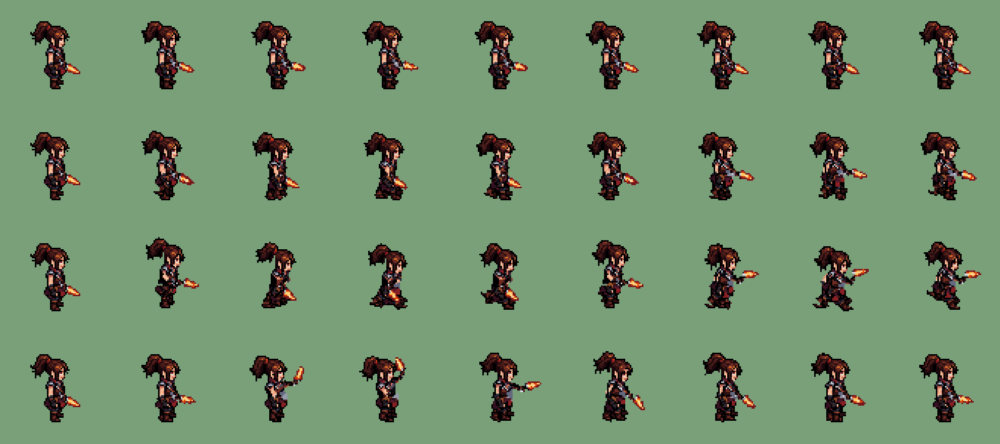

# AI Sprite Animation

Animate a **pixel-art sprite** from a single image, inside the Unity editor. Select a sprite, pick *Idle / Walk / Run / Attack / Jump / Crouch / ...*, and get imported frames and an
`AnimationClip` that show **the same character**, with its own palette, hard edges and transparency, and **no pixel redrawn**. It is a Unity package
(`com.limpo.ai-sprite-animation`) with three animation methods, from fully deterministic to AI-assisted, and it can be driven by [Claude Code](docs/claude-code.md).


*Idle, Walk, Run and Attack of one 48x48 sprite, made by the default Rig method. The first cell of every row is the source sprite; every other pixel is one of its pixels.*

```
Rig (default):  sprite + rig -> bone hierarchy moves the parts -> grounding -> majority-vote downsample -> crop + pivot -> sprites -> AnimationClip
AI Pose + Rig:  AnimateDiff video + SDPose -> retargeted pose asset -> the SAME Rig renderer (original pixels) -> same tail
AI Redraw:      sprite -> ComfyUI (AnimateDiff + IPAdapter + OpenPose ControlNet) -> frames -> palette snap + silhouette mask -> same tail
```

No cloud service, no account, no models in this repository: the default method needs nothing but Unity, and the optional AI methods run on your own GPU through a local ComfyUI.

## Contents

[Prerequisites](#prerequisites) - [Installation](#installation) - [Quick start](#quick-start) - [The three methods](#the-three-methods) - [Rig method](#rig-method-default) -
[AI Pose + Rig](#ai-pose--rig-beta) - [Using it with Claude Code](#using-it-with-claude-code) - [Output](#output) - [Configuration](#configuration) -
[Automation](#automation-batch-mode) - [Troubleshooting](#troubleshooting) - [Development](#development-and-tests) - [Contributing and license](#contributing-and-license) -
[Documentation](#documentation) - [Folder layout](#folder-layout)

## Prerequisites

| | Rig (default) | AI Pose + Rig (beta), AI Redraw (experimental) |
|---|---|---|
| Unity | **6000.6** (developed and tested on 6000.6.0f1 only; older versions are not claimed to work) | same |
| OS | Windows 11 (tested) | Windows 11 (tested) |
| GPU | none | NVIDIA with CUDA; tested on an RTX 3080 10 GB (AI Redraw peaks at about 7 GB VRAM) |
| ComfyUI | not needed | 0.38 (tested, portable NVIDIA build) with the AnimateDiff-Evolved node pack (AI Redraw also IPAdapter) |
| Models | none | SD 1.5 checkpoint + AnimateDiff v3 motion module; AI Pose + Rig also needs SDPose (1.92 GB, one-time installer in the window); AI Redraw also IPAdapter, CLIP vision and two ControlNets |
| Your art | a **side-view** humanoid pixel sprite (head, torso, arms, legs, optional weapon) | same |

Exact files, folders and download links for the AI methods: [package README, section 5](package/README.md#5-airedraw-mode-comfyui-setup) and [`sdpose-model.md`](package/Documentation~/sdpose-model.md).
Models are never committed to Git and are downloaded only when you ask ([licenses](docs/licenses.md)).

## Installation

**From Git** (Unity: *Window > Package Manager > + > Install package from git URL*):

```
https://github.com/JatCool/AI-Sprite-Animation.git?path=/package#v1.7.0
```

or add it to `Packages/manifest.json`:

```json
"com.limpo.ai-sprite-animation": "https://github.com/JatCool/AI-Sprite-Animation.git?path=/package#v1.7.0"
```

**From a local clone** (for development; the path is relative to your project's `Packages/` folder):

```json
"com.limpo.ai-sprite-animation": "file:../../AI-Sprite-Animation/package"
```

**Updating:** change the tag in the URL (`#v1.7.1`, `#v1.8.0`, ...), or drop the `#...` part to follow the default branch. Versions follow [SemVer](https://semver.org/) ([changelog](package/CHANGELOG.md)).
Your project's settings asset keeps working across patch and minor updates; new fields get package defaults.

After installing you have **Tools > AI Sprite Animation > Generate Animation** and, when you right-click a sprite, **AI > Generate Animation > Idle / Walk / Run / Attack / Rotate / Jump / Sit / Crouch / CrouchWalk**.
The first use creates `Assets/AISpriteAnimation/AIAnimationSettings.asset` (one per project; commit it).

## Quick start

1. Import your sprite as a normal Sprite (Point filter, no compression; the package can also set this on the generated frames from your source's settings).
2. Select the sprite in the Project window and right-click > **AI > Generate Animation > Walk**.
3. The first time, the sprite has no rig. Choose **open the Sprite Rig Editor** (recommended) or **auto-create** a starting rig. In the editor, drag the joints onto the character and paint the parts
   (arm, weapon, hair, legs) until the live preview looks right. The rig is made once per character and reused by every animation.
4. Generate again. After about a second you have `Assets/AIAnimations/<Sprite>/Walk/` with the frames and `<Sprite>_Walk.anim`.
5. Optionally assign an **Animator Controller** in the window: the clip goes into a state named `Walk`. A state that already holds your own hand-made motion is never overwritten, a separate `Walk (AI)` state is used instead; transitions are never touched.

Regenerating overwrites in place (GUIDs and Animator references survive) and removes stale frames. The source sprite is never modified.

## The three methods

| Method | How frames are made | Identity | ComfyUI | Time (RTX 3080) |
|---|---|---|---|---|
| **Rig (Recommended for Pixel Art)**, default | The sprite's own pixels are assigned to parts (head, hair, body, both arms, both legs, weapon) and moved through a bone hierarchy | **Pixel-exact**: same palette, details, face, weapon | No | about 1 s |
| **AI Pose + Rig (Beta)** | The AI generates only the *motion*; the same Rig renderer draws every frame from the original pixels | **Pixel-exact** (same renderer) | Only to generate poses, then stopped. Building from saved poses never | poses about 50-130 s once, then about 1 s per build |
| **AI Redraw (Experimental)** | AnimateDiff redraws every frame | Approximate: silhouette yes, pixel detail no | Yes (started and stopped automatically) | about 90-120 s |

Rig is the default because it was measured against the alternatives: no diffusion variant kept a 48x48 character's pixels (torso pixel match 0.10-0.29), while the rig only moves original pixels, so palette and details are identical
by construction ([benchmarks](package/Documentation~/benchmarks.md)).

## Rig method (default)

A **rig** says which pixels of your sprite are the head, hair, body, each arm, each leg and the weapon, and where the joints are. Animations move those parts through a bone hierarchy
(rotating an upper arm carries the forearm, hand and weapon). Every output pixel is an original pixel; transparency is the sprite's own alpha.

* **Pixel art guarantees:** parts are composed at 4x and reduced by majority vote per pixel, so the output only contains colours that exist in the source, with hard 0/255 alpha, no blending, no anti-aliasing.
  Where an arm swings away from the torso the vacated spot is filled with the surrounding body colour; translations snap to whole pixels.
* **Grounding:** every frame the lowest foot pixel is placed on the rig's ground line, so feet never drift; only intentional vertical movement (a run's flight phase, a jump) leaves it.
* **Stable pivot, no clipping:** work happens on a padded canvas, frames are cropped to the union of all used pixels, and the source pivot is mapped identically into every frame.
* **Overlapping limbs** (the usual side-view case) are supported: a pixel can belong to both legs. "Near" parts draw in front, "far" parts behind; a weapon is a child of the near hand.
* **Animations:** Idle, Walk, Run, Attack, Jump, Sit, Crouch, CrouchWalk (procedural pose sequences, 2-24 frames) and Rotate (the character turns to face the viewer, holds for a second, turns to the other side; needs the character's own front sprite). Details and defaults: [package README, section 3](package/README.md#3-rig-mode-recommended-for-pixel-art).
* **Sprite Rig Editor** (*Tools > AI Sprite Animation > Sprite Rig Editor*): joints tool, paint/fill parts, auto-assign, live preview of any preset with the real renderer, undo/redo.
* **Generated rigs:** the [Local Character Generator](https://github.com/JatCool/local-character-generator) can deliver the rig next to a generated sprite (`rig/rig.json`); the package then imports it automatically instead of auto-building one (package 1.7.0).
* **Add your own animation:** poses come through one interface (`IRigPoseProvider`); adding an animation type is a short checklist ([HANDOVER, "Adding an animation type"](package/Documentation~/HANDOVER.md)), and Claude can do it for you.

## AI Pose + Rig (beta)

The AI decides **how the character moves**; the sprite decides **what it looks like**. It never produces a pixel of the animation: it produces joint rotations, saved as a reusable *pose asset*, and the Rig renderer applies them.

```
AnimateDiff text-to-video (a generic person, side view) -> SDPose reads the skeleton of every frame -> keypoints retargeted to YOUR rig
 -> best repeatable stretch cut out -> validation + constraints + smoothing -> saved as <Sprite>_<Animation>_AIPose.asset   (ComfyUI is stopped here)
Build Animation (any time, no ComfyUI): saved poses -> unchanged Rig renderer -> original pixels -> frames -> AnimationClip
```

In the *AI Sprite Animation* window choose **Animation Method: AI Pose + Rig (Beta)**, then **Generate Poses**, **Preview Poses** and **Build Animation**.
The SDPose model is installed from the window (*Install / Download Model*, 1.92 GB, with a confirmation dialog, resumable and checksum-verified).

Honest by design: every pose asset records how much of its motion is the AI's own (negligible / moderate / significant, measured against the procedural animation), procedural motion is
**never** labelled AI, and there is no silent fallback between backends. Walk and Run come out plausible, Idle is subtle and Attack is the weakest: see the measurements and limits in
[`ai-pose-rig.md`](package/Documentation~/ai-pose-rig.md).

## Using it with Claude Code

The package is editor code with a command line, so Claude Code can operate it: *"create a walk animation for hero.png"*, *"I would like a double jump animation"*, *"the crouch looks too shallow"*.
A ready-made **skill** makes Claude find the sprite and its rig, run the Rig method (headless when your editor is closed, exact clicks when it is open), verify the result (frame count, shared pivot,
Point filter, original palette, hand-made Animator states untouched), report it as a draft and iterate until you approve. If an animation type is missing, Claude extends the package itself.

```bash
# in your Unity project
mkdir -p .claude/skills
cp -r <path to this repository>/integrations/claude-code/sprite-animation .claude/skills/
# then fill in the placeholders at the top of .claude/skills/sprite-animation/SKILL.md (Unity path, project path, sprite, controller)
```

Full guide with example prompts, a `CLAUDE.md` snippet, how to write or adapt your own skill, and the safety rules worth keeping: **[docs/claude-code.md](docs/claude-code.md)**.

## Output

```
Assets/AIAnimations/<Sprite>/<Animation>/
    input.png                    the image the generator started from
    frame_000.png ...            imported as Sprite (Single), same pivot on every frame
    <Sprite>_<Animation>.anim    AnimationClip (loops for Idle/Walk/Run/CrouchWalk, plays once for Attack/Jump/Sit/Crouch/Rotate)
```

Beside the sprite: `<Sprite>_Rig.asset` (joints, per-pixel part map, ground line) and, for AI Pose + Rig, `<Sprite>_<Animation>_AIPose.asset` (the final poses and a quantitative validation report).
Defaults: Idle 8 frames @ 12 fps, Walk 8 @ 12, Run 8 @ 14, Attack 10 @ 12, Rotate 18 @ 12, Jump 10 @ 12, Sit 8 @ 12, Crouch 6 @ 12, CrouchWalk 8 @ 12. Frame count is free (2-24).

## Configuration

| Where | What |
|---|---|
| `AIAnimationSettings` asset (per project, commit it) | method, output root, facing, PPU/filter of the generated frames (or copy them from the source), padding and crop, presets (frames, fps, loop, pose kind, rig intensity), pose clean-up |
| Window > *ComfyUI* section (EditorPrefs, per machine) | ComfyUI folder, Python, launch arguments, URL, timeouts (AI methods only) |
| `<Sprite>_Rig.asset` | the rig of one character; edit it in the Sprite Rig Editor |

Example for a 16 PPU pixel-art game: *Copy Import Settings From Source* off, *Pixels Per Unit* 16, *Filter Mode* Point, *Output Root* `Assets/Art/Generated`.
Every setting: [package README, section 6](package/README.md#6-configuration).

## Automation (batch mode)

```
Unity.exe -batchmode -nographics -projectPath <project> -executeMethod AISpriteAnimation.BatchRunner.Run ^
  -aiSource Assets/Art/hero.png -aiPreset Walk -aiFrames 8 -aiFps 12 -aiController Assets/Animations/Hero.controller
```

Exit code 0 = success, 1 = failure, 2 = cancelled. There are arguments for AI poses (`-aiMode pose -aiPoseAction generate|build|preview|reclean|importjson`), rig creation and import
(`-aiRigJoints`, `-aiRigImport`) and a self-test (`-aiSelfTest 1`); see [package README, section 8](package/README.md#8-automation-batch-mode). Unity allows one instance per project, so batch mode needs the editor closed.

## Troubleshooting

| Problem | Fix |
|---|---|
| A part moves with the wrong pixels | Open the Sprite Rig Editor: move the joints and paint the parts |
| Gaps or ghosting where an arm swings away | Paint the arm pixels as arm; the vacated spot is filled with the surrounding body colour |
| *SDPose model is required for AI Pose + Rig* | Use *Install / Download Model* in the window, or see [`sdpose-model.md`](package/Documentation~/sdpose-model.md). Nothing falls back to another backend |
| *SDPose did not find usable walk motion* | None of the generated clips was clean (SD 1.5 fails on about half of the seeds). Nothing was saved: generate again or raise *Pose Candidates* |
| *ComfyUI could not be started or is not reachable* | AI methods only. Check the *ComfyUI Folder*; the message includes ComfyUI's last output lines. *Diagnostics > Validate with ComfyUI* lists missing nodes and models |
| Batch mode says the project is locked | Close the editor that has the project open (one Unity instance per project) |

More: [package README, troubleshooting](package/README.md#troubleshooting).

## Development and tests

The rig, pose and constraint layers are pure math, so they are tested without Unity:

```bash
dotnet build -c Release -o tools/posetests/bin tools/posetests
tools/posetests/bin/posetests.exe <src.raw> tools/riglab/example_player_joints.txt
```

`tools/riglab` renders the rig without opening Unity, `tools/eval_identity.py` measures palette fidelity and identity, `tools/build_workflow.py` regenerates the AnimateDiff workflow.
See [`tools/README.md`](tools/README.md) and [CONTRIBUTING.md](CONTRIBUTING.md). **Taking over the project? Read [`package/Documentation~/HANDOVER.md`](package/Documentation~/HANDOVER.md) first.**

Releasing: bump `version` in `package/package.json`, add an entry to `package/CHANGELOG.md`, then

```bash
git commit -am "Release 1.7.1"
git tag v1.7.1
git push origin main --tags
```

## Contributing and license

* **Code: MIT License** ([LICENSE](LICENSE)). Use, modify, extend and redistribute it freely, also commercially. Contributions are accepted under the same license ([CONTRIBUTING.md](CONTRIBUTING.md)).
* **Models and ComfyUI are not covered by the MIT License.** The optional AI methods use third-party models (Stable Diffusion 1.5: OpenRAIL-M, AnimateDiff and IP-Adapter: Apache-2.0, SDPose: MIT, ...), each with its own license:
  [docs/licenses.md](docs/licenses.md). The default Rig method uses none of them.
* Never commit model files (the `.gitignore` blocks them).

## Documentation

| Document | Contents |
|---|---|
| [package/README.md](package/README.md) | the full reference: install, every method, the Rig Editor, ComfyUI setup, configuration, process lifecycle, diagnostics, batch mode, troubleshooting |
| [docs/claude-code.md](docs/claude-code.md) | using it with Claude Code: installing the skill, `CLAUDE.md`, example prompts, writing your own skill |
| [docs/licenses.md](docs/licenses.md) | code vs. model licenses |
| [package/Documentation~/HANDOVER.md](package/Documentation~/HANDOVER.md) | context, decisions, code map, conventions, what to update, how it was tested, known limits |
| [package/Documentation~/ai-pose-rig.md](package/Documentation~/ai-pose-rig.md) | AI Pose + Rig: design, constraint stage, measurements, limitations |
| [package/Documentation~/sdpose-model.md](package/Documentation~/sdpose-model.md) | the SDPose model: file, source, size, hash, license |
| [package/Documentation~/benchmarks.md](package/Documentation~/benchmarks.md) | why Rig is the default |
| [package/CHANGELOG.md](package/CHANGELOG.md) | what changed in each version |
| [tools/README.md](tools/README.md) | development tools |
| [CONTRIBUTING.md](CONTRIBUTING.md) | how to contribute |

## Folder layout

| Path | What |
|---|---|
| `package/` | the Unity package: `Editor/` code, `Workflows/` (ComfyUI), `Documentation~/`, `package.json`, README, CHANGELOG |
| `tools/` | `posetests/` (console tests), `riglab/` (rig renderer without Unity), `eval_identity.py`, `build_workflow.py` |
| `docs/` | repository-level guides and images |
| `integrations/claude-code/` | the Claude Code skill template |

Version 1.7.0 ([changelog](package/CHANGELOG.md)). Tested on Windows 11, Unity 6000.6.0f1, RTX 3080 10 GB, ComfyUI 0.38.0.
